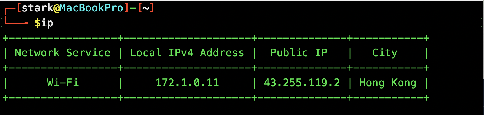

# IPGet - Network Interface Information Tool for macOS

[English](README.md) | [中文](README_zh.md)

IPGet is a lightweight command-line utility designed to simplify the process of retrieving network interface information on macOS systems. It provides a clean and focused output of active network interfaces' IP addresses, both internal and external, making it easier to access network information compared to the verbose output of the native `ifconfig` command.

## Features

- Quick access to active network interface information
- Display of both internal (IPv4) and external IP addresses
- Clean and focused output format
- Simple installation and usage

## System Requirements

- macOS (Only)

## Installation

### Via Homebrew (Recommended)

This project is available on Homebrew. You can easily install it using:
```bash
brew install ipget
```

> Note: The package name on Homebrew is 'ipget' to avoid potential naming conflicts with other packages.

### Build from Source

Clone the repository:
```bash
git clone https://github.com/StarkChristmas/ipget
```

Install Go 1.24:
```bash
brew install go
```

Build the project:
```bash
cd ipget && go run -o ip ./main.go
```

Move to `/usr/local/bin` and make it executable:
```bash
mv ip /usr/local/bin/ && chmod +x /usr/local/bin/ip
```

### Download Pre-built Binary

For Apple Silicon:
```bash
wget $(curl -s https://api.github.com/repos/StarkChristmas/ipget/releases/latest \
  | jq -r '.assets[] | select(.name | test("arm64.*\\.tar\\.gz$")) | .browser_download_url')
```

For Intel:
```bash
wget $(curl -s https://api.github.com/repos/StarkChristmas/ipget/releases/latest \
  | jq -r '.assets[] | select(.name | test("x86_64.*\\.tar\\.gz$")) | .browser_download_url')
```

Move to `/usr/local/bin` and make it executable:

For Apple Silicon:
```bash
mv ipget_arm64 /usr/local/bin/ip && chmod +x /usr/local/bin/ip
```

For Intel:
```bash
mv ipget_x86_64 /usr/local/bin/ip && chmod +x /usr/local/bin/ip
```

## Usage

Simply run the command in your terminal:
```bash
ip
```

## Example Output



## Why IPGet?

The native `ifconfig` command on macOS provides comprehensive information about all network interfaces, which can be overwhelming when you only need to check the IP address of your active network connection. IPGet simplifies this process by:

- Filtering out inactive network interfaces
- Focusing on essential IP information
- Providing a cleaner, more readable output
- Making it easier to quickly identify your current network configuration

## License

This project is licensed under the MIT License - see the [LICENSE](LICENSE) file for details.

## Contributing

Contributions are welcome! Please feel free to submit a Pull Request.
